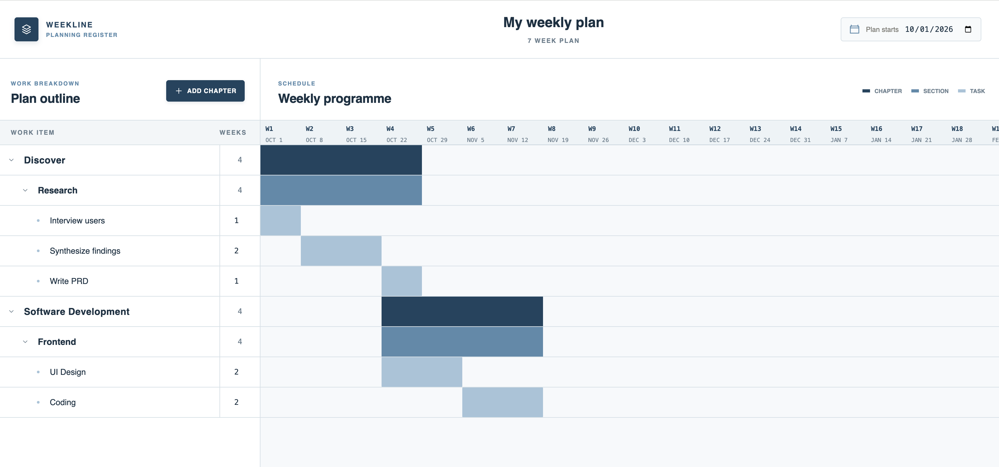

# Weekline

Weekline is a local-first weekly planning application that turns a structured plan into a Gantt chart. Organize work into chapters, sections, and tasks, then connect their schedules with finish-to-start relationships.



## Features

- Organize work as **chapters → sections → tasks**.
- Schedule tasks in weeks and automatically calculate chapter and section ranges.
- Link chapters, sections, and tasks with finish-to-start dependencies.
- Start a task with its parent section using **Section start**.
- Start a section with its parent chapter using **Chapter start**.
- Give an empty chapter or section its own start date (or link it after an existing task) and duration.
- Automatically replace a chapter or section's manual duration with the summed duration of its children.
- Collapse chapters and sections to focus on the work you need.
- Store the entire plan locally in SQLite—no account or external database server required.

Dependency links follow the plan hierarchy:

- Chapters can link to chapters, sections, or tasks.
- Sections can link to sections or tasks.
- Tasks can link to tasks.
- Chapters and sections cannot link to items contained inside themselves.

## Tech Stack

| Layer | Technology |
| --- | --- |
| Frontend | React and CSS |
| Backend | Node.js HTTP server |
| Database | SQLite through Node.js `node:sqlite` |
| Build tooling | Vite |
| Code quality | ESLint |

## Quick Start

### Requirements

- [Node.js 24 LTS](https://nodejs.org/en/download) is recommended.
- SQLite does **not** need to be installed separately; Weekline uses the SQLite module included with Node.js.

These requirements are the same on Windows, macOS, and Linux.

### Install and run

After cloning or downloading the repository, open a terminal in the project directory and run:

```bash
npm install
npm run build
npm start
```

Open <http://localhost:3001> in your browser.

On its first launch, Weekline automatically creates `data/weekline.db`.  Back it up if you want to preserve or move a plan to another computer.

### Development mode

To run the React development server with automatic reloading:

```bash
npm install
npm run dev
```

Open <http://localhost:5173>. The Node.js API runs at <http://localhost:3001>.

## Available Commands

| Command | Description |
| --- | --- |
| `npm run dev` | Run the React client and Node.js API in development mode. |
| `npm run build` | Create the production frontend build. |
| `npm start` | Serve the API and production frontend at port 3001. |
| `npm run check` | Run ESLint and verify the production build. |

## Data Storage

All plan data is stored in `data/weekline.db` on the same computer that runs the application. Weekline creates the `data` directory and database file automatically when the server starts.
